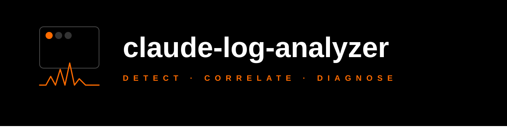

<p align="center">
  
</p>

<p align="center">
  <a href="https://www.npmjs.com/package/claude-log-analyzer"></a>
  <a href="https://www.npmjs.com/package/claude-log-analyzer"></a>
  
  
  
  <a href="https://github.com/samarthpatel24/claude-log-analyzer/blob/main/LICENSE"></a>
</p>

<p align="center">
  MCP server that connects to your Kubernetes cluster and provides Claude Code with tools for log analysis, anomaly detection, and root cause analysis.
</p>

---

## What it does

- Fetches pod logs, status, metrics, and events from a live K8s cluster
- Detects anomalies: CPU/memory spikes, error bursts, restart storms, OOM kills
- Correlates events across services to identify cascading failures
- Produces evidence-backed root cause analysis reports (MD or TXT)
- Every finding cites actual log lines, metric values, or event data

## Install

Add to your project's `.mcp.json`:

```json
{
  "mcpServers": {
    "k8s-analyzer": {
      "command": "npx",
      "args": ["-y", "claude-log-analyzer"]
    }
  }
}
```

> **Windows users:** Use `"command": "cmd"` with `"args": ["/c", "npx", "-y", "claude-log-analyzer"]`

## Prerequisites

-  
- A valid kubeconfig (`~/.kube/config` or set `KUBECONFIG` env var)
- RBAC permissions to read pods, logs, events, and metrics
- metrics-server on the cluster (optional, for resource metrics)

## Tools

| Tool | Description |
|------|-------------|
| `list_namespaces` | List all namespaces in the cluster |
| `fetch_pod_logs` | Fetch and filter pod logs with severity detection and noise removal |
| `get_pod_status` | Pod phase, conditions, container states, restart counts |
| `get_resource_metrics` | CPU/memory usage via Metrics API with % against limits |
| `get_events` | Kubernetes events (Warning/Normal) with filtering |
| `get_cluster_health` | High-level cluster health overview |
| `detect_anomalies` | Run anomaly detection on a namespace |
| `analyze_service` | Deep dive on a specific service |
| `get_root_cause_analysis` | Full RCA with exported report |

## Configuration

### Environment variables

| Variable | Default | Description |
|----------|---------|-------------|
| `KUBECONFIG` | `~/.kube/config` | Path to kubeconfig file |
| `K8S_CONTEXT` | current-context | Kubernetes context to use |
| `K8S_DEFAULT_NAMESPACE` | `default` | Default namespace |
| `K8S_LOG_MAX_LINES` | `500` | Max log lines per pod |
| `K8S_TIME_WINDOW` | `60` | Default time window in minutes |
| `K8S_MODE` | `both` | Default mode: `logs`, `metrics`, or `both` |

Pass env vars through MCP config:

```json
{
  "mcpServers": {
    "k8s-analyzer": {
      "command": "npx",
      "args": ["-y", "claude-log-analyzer"],
      "env": {
        "KUBECONFIG": "/path/to/kubeconfig",
        "K8S_TIME_WINDOW": "30",
        "K8S_MODE": "logs"
      }
    }
  }
}
```

### Per-call configuration

Every analysis tool accepts:
- `timeWindowMinutes` — override the default time window
- `mode` — `"logs"`, `"metrics"`, or `"both"`

The `get_root_cause_analysis` tool also accepts:
- `exportFormat` — `"md"` (default) or `"txt"`
- `exportPath` — custom file path for the report

## Token efficiency

The server minimizes token usage by:
- Filtering out noise (health checks, liveness/readiness probes)
- Detecting log severity to skip irrelevant lines
- Summarizing log results (error counts, top errors) alongside raw data
- Truncating with a `truncated` flag so Claude can narrow queries
- Returning only a summary from the RCA tool (full details go to the exported report)

## Anomaly detection

- **CPU/memory spikes** — peer comparison (z-score against sibling pods) + threshold-based (% of limit)
- **Error bursts** — 1-minute bucketing, flags statistical outliers (mean + 3σ) and absolute thresholds
- **Restart storms** — restart count thresholds + CrashLoopBackOff detection
- **OOM kills** — container termination reason + event scanning
- **Event floods** — warning event count per object with auto-escalation for critical reasons

## Report output

Reports are written to disk, not returned in full to the LLM. Every claim is backed by evidence:

```
### [CRITICAL] OOM Kill — pod/payments-7f8b9-x2k4
- **Description:** Container 'payments' was OOM killed (exit code: 137)
- **Value:** 7 (threshold: 3)

### [HIGH] Error Burst — pod/payments-7f8b9-x2k4
- **Description:** 142 errors/min detected (baseline: 3.0/min). 284 total errors in window.
- **Sample log lines:**
  - `java.lang.OutOfMemoryError: Java heap space`
  - `Failed to process transaction: heap exhausted`
```

## License

[MIT](LICENSE)
